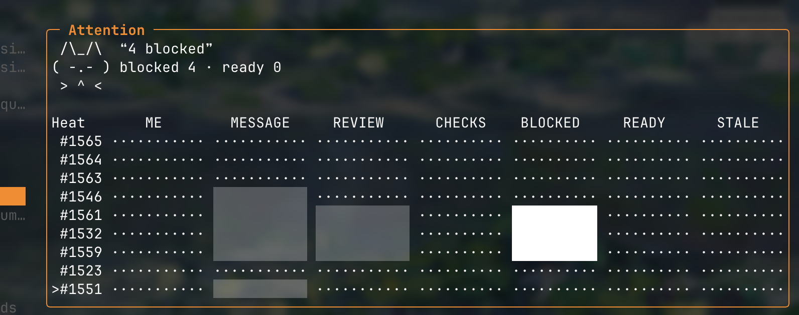

# ♜ Watchtower

Terminal inbox for GitHub PRs and issues that need attention.

Watchtower tracks configured repos, separates actionable work into **Incoming**, keeps quiet watched work in **Watching**, and lets you mark items seen, unwatch them, open GitHub, or run configured actions without leaving the terminal.


🆕 Heatmap for PR state



```text
         /\_/\
        ( o.o )   ❝ try, it's free! ❞
         > ^ <
```

## Install

Requires Go and the GitHub CLI.

```sh
go install github.com/owenps/watchtower@latest
```

Authenticate GitHub CLI:

```sh
gh auth login
```

Run:

```sh
watchtower
```

On first launch, Watchtower prompts for a repo in `owner/name` format.

## Development install

```sh
git clone https://github.com/owenps/watchtower.git
cd watchtower
go install .
watchtower
```

## Config

Global config lives at:

```text
~/.config/watchtower/config.toml
```

State lives at:

```text
~/.local/share/watchtower/state.db
```

Debug logs:

```sh
watchtower --debug
```

writes to:

```text
~/.config/watchtower/debug.log
```

## Keys

- `j/k` move
- `tab` switch Incoming / Watching
- `enter` detail
- `s` mark Incoming item seen
- `u` unwatch
- `a` actions
- `o` open in browser
- `/` search
- `?` settings
- in settings: `tab` switches General/repo tabs, `enter` changes selected row; changes auto-save
- `r` refresh
- `q` quit
